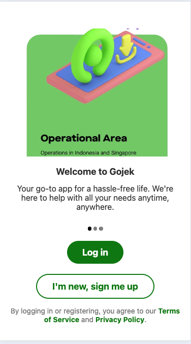
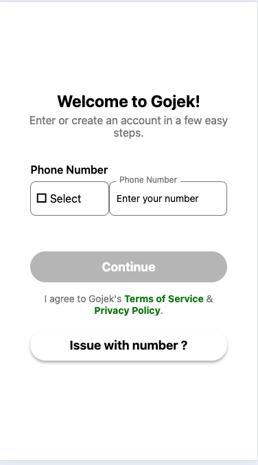

# Practical One: Gojek App Development

## 1. Project Initialization
- Initialized the Expo project using the following command:
    ```bash
    npx create-expo-app@latest
    ```

## 2. Splash Screen Creation
- Created a page named `home.tsx` under the `tabs` directory inside the `app` directory.
- Referenced the [Splash Screen Implementation documentation](https://docs.expo.dev/versions/latest/sdk/splash-screen/) from Expo.
- Used the Expo router to redirect the user to `auth/landing.txt` after the splash screen is displayed, following the guidelines in the [Expo Router documentation](https://docs.expo.dev/routing/intro/).

    

## 3. Login Page Implementation
- Added a dropdown to the login page using the `react-native-element-dropdown` package.
- Customized the dropdown to display country flags alongside the country names for a more user-friendly interface.
- Explored and utilized the [`TouchableOpacity`](https://reactnative.dev/docs/touchableopacity) component for buttons, as explained in the React Native documentation, to make buttons interactive and responsive.

    

## 4. Verification Type Page
- Created a page for selecting the verification type, using `TouchableOpacity` for button interactions, ensuring a smooth and consistent user experience.

    

## 5. OTP Verification Page
- Designed the OTP verification page using `TouchableOpacity` for button interactions and `TextInput` for capturing user input for OTP entry.

    

